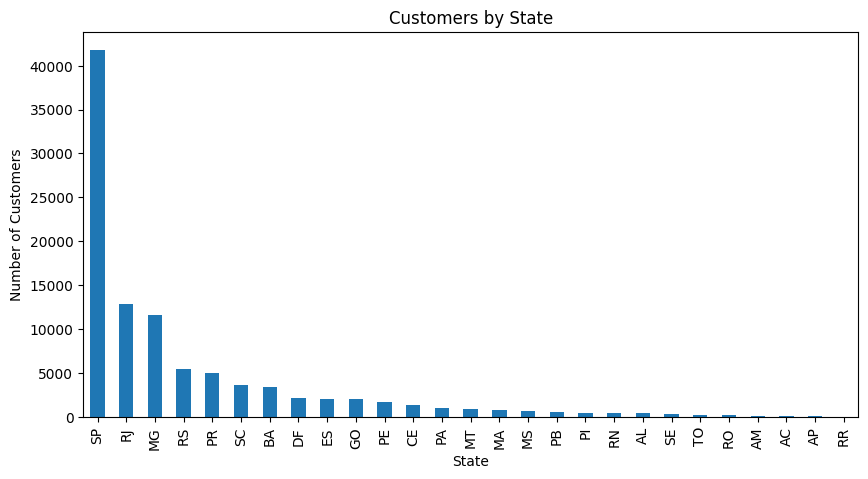
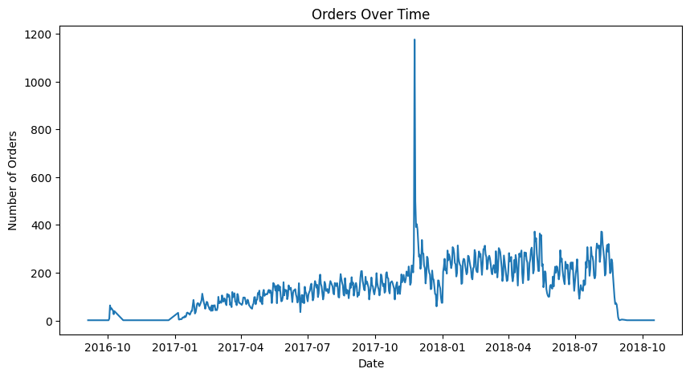
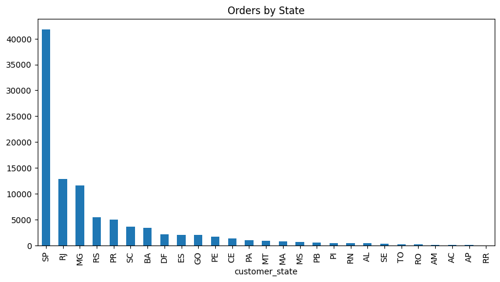
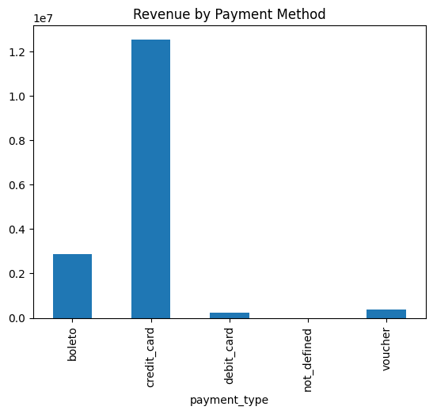
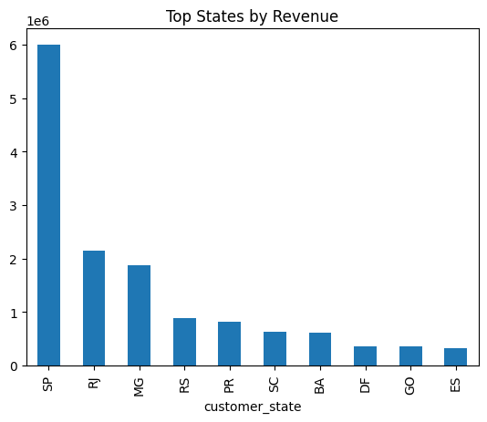
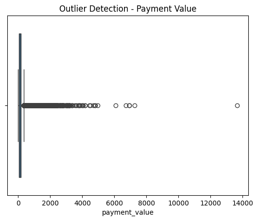

E-commerce Data Cleaning & Visualization Project

This project focuses on cleaning, processing, and analyzing an e-commerce dataset to extract meaningful insights about customer behavior, order trends, and revenue patterns.

The dataset consists of multiple files including customer data, order details, and payment information. These datasets were merged to perform comprehensive analysis.

Data Cleaning:
1.Removed duplicate records
2.Handled missing values using forward fill method
3.Converted date columns to proper datetime format
4.Detected and removed outliers in payment values

Data Processing:
1.Merged customer, order, and payment datasets
2.Created new features such as order date breakdown
3.Prepared final dataset for analysis  

Visualizatons:

Key Insights:
1.Majority of customers are from São Paulo
2.Order trends show fluctuations over time
3.Credit card is the dominant payment method
4.Revenue is concentrated in a few states

This project demonstrates the complete data analysis pipeline including data cleaning, preprocessing, visualization, and insight generation. The findings can help businesses understand customer behavior and improve decision-making.